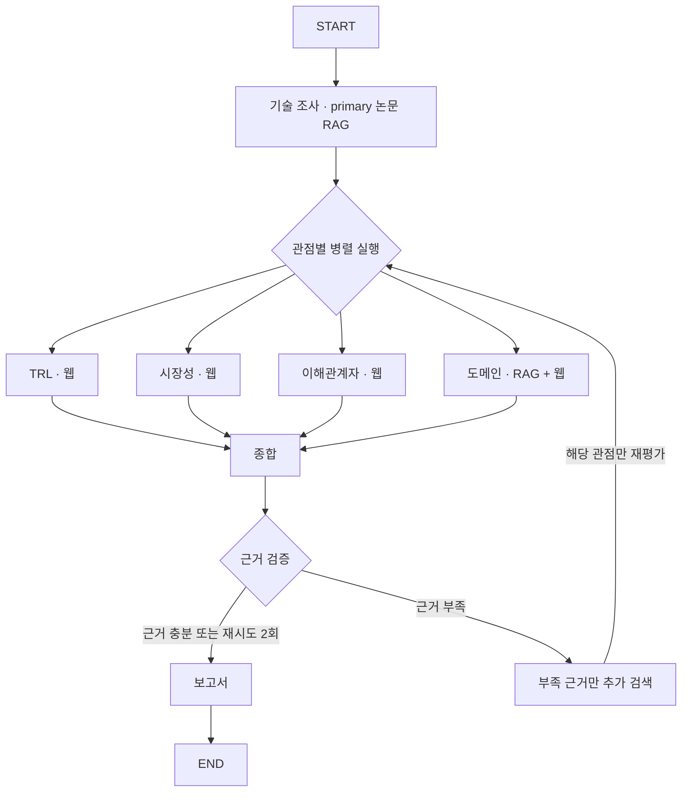

# SKALA Agent — KV Cache 기술 비교

TurboQuant(SW)와 ITME(HW)를 데이터센터·클라우드 서빙 관점에서 비교하는 Agentic RAG 프로젝트의 협업용 뼈대입니다.

**현재는 API 키 없이 실행되는 개발용 workflow입니다.** 실제 PDF 검색, BGE-M3 임베딩, VectorDB, LLM 평가와 웹검색은 연결 전입니다. 기본 provider는 결과를 만들어내지 않고 `판단 보류`를 반환합니다. 설계서의 기술 주장·논문 ID·성능 수치는 검증된 사실로 사용하지 않습니다.

## 빠른 시작

Python 3.12와 [uv](https://docs.astral.sh/uv/)를 사용합니다. `uv`가 관리할 Python 버전은 `.python-version`에 지정했습니다.

```bash
make setup
make run
make test
make lint
```

결과: `outputs/report.md` (Git 제외). 기본 실행은 외부 API를 호출하거나 임베딩 모델을 내려받지 않습니다. 최초 설치에는 인터넷 연결이 필요합니다.

```bash
uv run skala-agent --output outputs/my-report.md
```

## 구성

```text
src/skala_agent/
  schemas.py              # Technology / Evidence / Assessment / Chunk 공통 계약
  providers.py            # 실제 검색·평가 연동 계약 + DemoProvider
  agents/                 # 기술 조사, 관점별 평가, 종합, 검증, 재검색, 보고서
  workflow/               # LangGraph 및 reducer가 있는 공통 State
  retrieval/              # PDFParser / Embedder / VectorStore / Retriever 계약
  evaluation/             # Hit@1, Hit@3, MRR 계산
  prompts/                # 관점별 프롬프트 초안
configs/                  # 문서 후보 목록
data/                     # raw PDF / processed 청크·벡터 (Git 제외)
docs/                     # 설계 참고 문서 및 인터페이스 설명
tests/                    # workflow, retry, 검증, 검색 지표 테스트
```

## Workflow



실제 구현은 LangGraph `Send`로 같은 평가 노드를 관점별로 병렬 실행하고 결과를 합칩니다. retry에서는 부족한 관점만 선택합니다. [공식 Send 문서](https://reference.langchain.com/python/langgraph/types/Send)를 참고했습니다.

- `analyses`는 관점 이름을 키로 병합하므로 병렬 쓰기가 충돌하지 않습니다.
- `evidence`는 `operator.add`로 누적합니다. 출처 수는 고유 URL 기준입니다.
- 같은 관점의 retry는 이전 판정을 교체합니다. 정상 관점의 결과는 유지합니다.
- 검증된 출처가 2개 미만이면 `confidence=low`입니다.
- 근거가 없는 판정은 재시도 후에도 보고서에서 제외하고 판단 보류로 표시합니다.
- 현재 검증은 출처 연결·기술 ID·`supports_claim` 확인입니다. 실제 의미적 지지 여부 및 중립성 검증은 구현해야 합니다.

## Contributors

| 담당자 | 책임 | 시작할 파일/폴더 |
| --- | --- | --- |
| 김동찬 | PDF Parsing 및 문서 전처리, Chunking / Metadata 설계, BGE-M3 Embedding 적용, VectorDB 및 Retrieval Pipeline 구현, Retrieval 성능 평가 (Hit@1, Hit@3, MRR) | `retrieval/`, `evaluation/`, `schemas.py`의 Chunk |
| 김강휘 | TRL·시장성·이해관계자·도메인 평가 Agent, Agent별 Prompt 및 Structured Output 설계 | `agents/{trl,market,stakeholder,domain}.py`, `prompts/`, `providers.py` |
| 윤소영 | LangGraph Workflow, State Schema, Fan-out / Fan-in, Conditional Branch 및 Retry Loop, Agent 간 데이터 흐름 통합 | `workflow/`, `schemas.py`, `providers.py` |
| 이준형 | Synthesis Agent, Evidence Validation, Report Generation Agent, Citation / Reference, End-to-End 테스트 및 README | `agents/{synthesis,validation,report}.py`, `tests/`, `README.md` |

기술 조사 Agent는 김동찬의 Retrieval과 김강휘의 추출 프롬프트를 연결하고, 추가 검색 Agent는 김강휘의 검색 구현과 윤소영의 retry 흐름을 연결하는 공동 통합 지점입니다.

상세 작업 순서·인수인계 산출물·완료 기준은 [담당별 개발 안내](docs/development-guide.md)를 참고하세요.

## 다음 구현 순서

1. 김동찬: 문서 후보 원문 확인 → PDF 파싱 → 청크 metadata → BGE-M3 → VectorDB → 검색 평가셋.
2. 김강휘: 관점별 세부 output schema 확정 → 프롬프트 적용 → 실제 provider의 `research`, `assess`, `search_missing` 구현.
3. 윤소영: provider를 `build_graph(provider)`에 주입하고 실제 데이터 통합. 필요하면 checkpoint·실행 로그·오류 처리 추가.
4. 이준형: 설계서 4-7 상충 탐지, 문장별 근거 검증·중립성 검사, 참고문헌 서식과 보고서 본문 구현.

`prompts/*.md`는 참고 초안이며 현재 demo는 읽지 않습니다. 실제 provider에서 읽고 structured output schema와 함께 적용해야 합니다. 실제 모델·검색 provider 및 VectorDB 제품은 아직 고정하지 않았습니다.

## Git 협업

```bash
git clone https://github.com/kchanis1223/-SKALA-_KVCache_report_Agent.git
cd -- -SKALA-_KVCache_report_Agent
git switch main
make setup
git switch -c feat/담당기능
# 구현 및 검증 후
git add <변경한-파일>
git commit -m "기능: 변경 내용을 한글로 작성"
git push -u origin feat/담당기능
```

GitHub에서 `main` 대상으로 PR을 만듭니다. 기존 개인 브랜치가 있으면 최신 `origin/main`을 병합한 뒤 작업하세요.

`.env`, PDF, 벡터 인덱스, 출력 보고서는 제외됩니다. `uv.lock`은 커밋해서 동일한 의존성을 사용합니다. GitHub Actions에서 lint·테스트·demo 실행을 확인합니다.

개발 규칙: [CONTRIBUTING.md](CONTRIBUTING.md) · 계약: [docs/interfaces.md](docs/interfaces.md) · 제공 설계서: [docs/design-v1.1.md](docs/design-v1.1.md)
