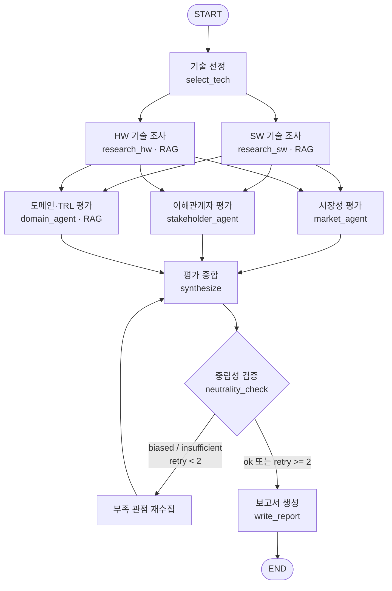

# KV cache 최적화 기술 다관점 평가 — 설계 문서

> 과제: LangGraph 기반 Multi-Agent + Agentic RAG 설계 및 개발
> 주제: KV cache 최적화 기술 다관점 평가 — SW 압축 vs HW 메모리 접근
> 작성일: 2026-09-21 (초안 v0.1)

---

## 0. 분석 배경 — 왜 KV cache인가

LLM은 토큰을 하나씩 생성하면서 앞서 계산한 Key/Value를 저장해 재사용한다(KV cache).
재계산 낭비는 사라지지만, 문맥 길이에 비례해 저장량이 선형 증가하여 가속기의 HBM 용량을
빠르게 소진한다. 즉 **KV cache는 "연산 병목"을 "메모리 병목"으로 치환한 구조**다.

이 병목을 푸는 접근은 정반대 두 방향으로 갈린다.

- **SW 진영** — 데이터를 작게 만든다 (압축/양자화, 어텐션 아키텍처 개선)
- **HW 진영** — 담을 공간을 넓힌다 (메모리/스토리지 계층 확장)

본 과제는 두 진영에서 각 1건을 선정해, **어느 쪽이 우월한가가 아니라
관점에 따라 평가가 어떻게 갈리는가**를 비교한다.

---

## A. 대상 기술 선정

### 선정 결과

| 진영 | 기술 | 논문 | 핵심 주장 |
|---|---|---|---|
| SW | **TurboQuant** | TurboQuant: Online Vector Quantization with Near-optimal Distortion Rate (2025-04) | KV cache 3비트 양자화, 어텐션 처리 최대 8배 |
| HW | **ITME** | ITME: Inference Tiered Memory Expansion with Disaggregated CXL-Hybrid Memories (2026-06) | CXL-Hybrid 계층적 메모리 확장, 처리량 1.80배 |

### 선정 사유

**1) 접근 방식이 가장 선명하게 대립한다.**
TurboQuant은 데이터 자체의 비트 수를 줄이는 *사후 압축*이고, ITME는 원본을 그대로 둔 채
*담을 공간의 계층을 확장*한다. "작게 만들기 vs 넓게 담기"라는 과제의 대립 축을 가장 직접적으로 대표한다.

**2) 전제 조건이 정반대다.**
TurboQuant은 기존 GPU 위에서 SW만으로 즉시 적용 가능한 대신 정확도 손실 위험을 진다.
ITME는 정확도 손실이 없는 대신 CXL이라는 **새로운 하드웨어 전제**를 요구한다.
이 비대칭이 도메인·시장·이해관계자 관점에서 서로 다른 방향의 평가를 유발할 것으로 예상된다.

**3) 기술 성숙도(TRL) 단계가 다를 것으로 추정된다.**
TurboQuant은 알고리즘 수준이라 검증 주기가 짧고, ITME는 하드웨어 생태계 성숙에 종속된다.
TRL 격차 자체가 비교 소재가 된다.

> **검토했으나 선정하지 않은 대안**
> - DeepSeek MLA: 압축률(93.3%)은 가장 크지만 *모델 재학습*이 전제라 사후 적용 기술과 비교 축이 어긋남
> - KIVI: 양자화 계열 베이스라인으로 유용하나 TurboQuant과 접근이 중복
> - InfiniGen: 호스트 메모리 오프로딩으로 ITME와 진영이 겹침. **대조 참고 자료로만 활용**

---

## B. 설계

### B-1. 기술 선정 방식

**2안 (Human 기반)** — 조가 직접 선정.

*사유:* 본 과제의 분석 가치는 "무엇을 고르느냐"보다 **"고른 둘을 얼마나 다층적으로 비교하느냐"**
에 있다. 선정을 에이전트에 맡기면 선정 근거의 재현성이 떨어지고, 비교 축이 흐려질 위험이 있다.
대신 선정 기준(대립성·전제조건 비대칭·TRL 격차)을 명시하여 주관성을 통제한다.

### B-2. RAG 적용 대상

| 에이전트 | RAG | 근거 |
|---|:---:|---|
| 🔍 기술 조사 | **O (필수 적용)** | 원문 논문에서 개요·범위·한계를 추출해야 하므로 원문 기반 검색이 필수 |
| 📊 시장 평가 | △ 웹검색 | 시장 자료는 논문 풀에 없음 → Tavily 웹검색 |
| 🤝 이해관계자 평가 | X 웹검색 | 경쟁사·개발자·투자 반응은 실시간 정보 |
| 🏭 도메인 평가 | **O (보조 적용)** | 논문의 실험 환경·제약 조건 근거가 필요 → 원문 RAG + 웹검색 병행 |
| ⚖️ 평가 종합 | X | State에 축적된 결과만 사용 |
| 📝 보고서 생성 | X | State에 축적된 결과만 사용 |

→ 가이드 요건("RAG 여부 O 중 최소 1개") 충족: **기술 조사 + 도메인 평가 2개 적용**

### B-3. 문서 풀 (총 200페이지 한정)

| 구분 | 문서 | 예상 분량 | 용도 |
|---|---|---|---|
| SW | TurboQuant (2025-04) | ~30p | 주 분석 대상 |
| HW | ITME (2026-06) | ~15p | 주 분석 대상 |
| 참고 | KIVI (2024-06) | ~20p | 양자화 베이스라인 대조 |
| 참고 | InfiniGen (2024-06) | ~15p | 메모리 확장 계열 대조 |

*실제 페이지 수는 PDF 확보 후 확정하며, 200p를 넘지 않도록 참고 문서를 조정한다.*

### B-4. 임베딩 모델 선정

**선정: `BAAI/bge-m3` (오픈소스, Apache-2.0)**

후보 비교:

| 모델 | Max Tokens | Dim | 다국어 | 크기 | 판단 |
|---|---|---|---|---|---|
| **BAAI/bge-m3** | 8,192 | 1,024 | 100+ | 0.57B | **선정** |
| intfloat/multilingual-e5-large | 512 | 1,024 | O | 0.56B | 512 토큰 제한이 결격 |
| Qwen3-Embedding-0.6B | 32,768 | 1,024 | O | 0.6B | 후보. 컨텍스트는 우수하나 Sparse 미지원 |

**선정 근거 (본 과제의 요건 기준)**

1. **교차 언어 검색이 기본 조건이다.** 대상 문서는 영문 논문이고 에이전트 질의와 보고서는
   한국어다. 한국어 질의 → 영문 청크 검색이 성립해야 하므로 다국어 모델이 필수다.
2. **논문은 섹션 단위로 의미가 완결된다.** Method, Evaluation 같은 섹션을 통째로 임베딩해야
   맥락이 보존되는데, 512 토큰 모델은 섹션 중간에서 잘린다. 8,192 토큰은 이 요구를 충족한다.
3. **Dense + Sparse를 한 모델에서 제공한다.** 이번 문서에는 `CXL`, `HBM`, `NVMe`, `TRL` 같은
   고유명사·약어가 밀집해 있어 정확 매칭(Sparse)이 반드시 필요하다. bge-m3는 Dense·Sparse·ColBERT
   멀티 벡터를 동시에 내주므로 **별도 BM25 인덱스 없이 Hybrid 검색을 구성**할 수 있다.
4. **경제성.** 0.57B로 로컬(CPU/MPS)에서 구동 가능하여 임베딩 API 비용이 0이다.

> ⚠️ *"리더보드 상위"는 선정 근거로 사용하지 않았다.* 리더보드는 후보군을 좁히는 출발점으로만
> 활용했고, 최종 선정은 위 4가지 과제 요건과의 적합성으로 판단했다.
> 확정 전 검증: 4개 문서로 소규모 평가셋(질문 20개)을 만들어 후보 3종의 **Hit@3 / MRR**을 측정한다.

---

## C. 평가 관점 및 기준

### C-0. 전제

본 평가는 두 기술의 **우열을 판정하지 않는다.** 동일한 KV cache 병목에 대한 상반된
접근이 관점에 따라 어떻게 다르게 인식되는지를 조사·비교한다.

각 관점 에이전트는 **기술 간 비교를 수행하지 않고 각 기술을 독립적으로 판정**한다.
비교는 종합 단계에서 판정 결과를 병치함으로써 발생한다.

모든 판정은 `판정 등급 + 근거 URL 1건 이상 + confidence`를 함께 기록한다.
출처가 2건 미만인 판정은 `confidence: low`로 표기한다.

### C-1. 선정 도메인 — 데이터센터 · 클라우드 서빙

데이터센터의 성격은 **대규모 · 비용 민감 · 멀티테넌시 · SLA 준수**이며, 이 네 가지가
평가 기준 설계의 기반이 된다.

**선정 사유**

1. KV cache 병목이 **비용으로 환산되는** 환경이다. HBM 점유는 곧 동시 처리 가능한
   요청 수를 결정하므로 두 기술의 효과를 같은 단위로 평가할 수 있다.
2. **두 기술 모두 적용 가능하다.** 비교축이 "적용 가능성"이 아니라 "도입 조건(비용
   구조·리드타임·리스크)"이 되어 네 관점이 균등하게 작동한다.
3. 공개 자료(시장 리포트, 벤더 로드맵, 표준화 동향)가 풍부해 관점별 근거 수집의
   편차가 작다.

**검토했으나 제외한 도메인**

OnDevice AI는 CXL 인터커넥트가 부재하여 ITME가 원리적으로 적용 불가하다. 한쪽
기술만 평가 가능해져 다관점 비교가 성립하지 않으므로 제외했다.

---

### C-2. 기술 성숙도 관점 — TRL 기반

TRL은 SWOT처럼 상대적·주관적인 척도가 아니라 "지금 몇 단계인가"라는 절대 위치를
제공하므로, 두 기술을 같은 잣대로 놓기 위해 채택한다.

**평가 대상**

| | 수집 항목 |
|---|---|
| ⓐ | 재현 가능한 구현체 존재 (공식 또는 3rd-party 저장소) |
| ⓑ | 주요 추론 프레임워크 지원 (vLLM, TensorRT-LLM, SGLang 등) |
| ⓒ | 상용 제품·서비스 탑재 발표 |

**판정 기준**

| 관측 결과 | 판정 |
|---|---|
| 논문만 존재, 구현체 확인 안 됨 | TRL 1~3 |
| ⓐ 확인 | TRL 4~5 |
| ⓑ 확인 | TRL 6~7 |
| ⓒ 확인 | TRL 8~9 |

**필수 명시 사항**

> KV cache 기술은 논문 발표와 실제 채택 사이에 시차가 있으며, 특히 TRL 4~6 구간은
> 공개 정보 GAP이 가장 크다. 본 평가의 TRL은 **공개 정보 기반 추정치**이며, 각
> 판정에 추정 근거(저장소 URL·지원 문서·발표 자료)를 함께 기록한다.

---

### C-3. 시장성 관점

3개 축으로 구성한다. 비용·TCO는 **C-5 축 A로 이관**하여 관점 간 중복을 제거했으며,
생태계·공급망과 확장성은 **"생태계 지지"** 로 통합했다. 시장성은 "시장이 이 접근을
원하고, 받아들이고, 떠받치고 있는가"에 집중한다.

#### 축 1 — 접근 방식에 대한 수요

*조사 항목*
- KV cache 메모리 병목이 데이터센터의 비용·성능 문제로 언급되는가
- long-context 및 대규모 LLM serving 수요가 증가 추세인가
- **해당 접근 방식**(SW 압축 / HW 메모리 확장)에 비용을 지불할 고객군이 식별되는가

*판정*

| 확인 항목 | 판정 |
|---|---|
| 0~1건 | 수요 불명확 |
| 2건 | 수요 존재 |
| 3건 | 수요 확실 |

> 세 번째 항목을 **접근 방식 단위**로 좁혀 기술별 차등 평가가 가능하도록 했다.
> "병목이 존재하는가"는 두 기술에 공통이므로 그것만으로는 판정이 갈리지 않는다.

#### 축 2 — 상용화 및 실제 채택

*조사 항목*
- 실제 제품·서비스·클라우드 환경에 적용된 사례가 있는가
- 논문·프로토타입을 넘어 제품 단계까지 진행되었는가
- 고객 또는 운영 환경에서 지속 사용된 근거가 있는가

*판정*

| 확인 항목 | 판정 |
|---|---|
| 0건 | 연구 단계 |
| 1건 | 시범 적용 |
| 2~3건 | 상용 채택 |

#### 축 3 — 생태계 지지

기술을 둘러싼 **지원 기반의 폭**을 본다. 프레임워크·표준·공급망이 받쳐주는가(지지의
깊이), 그리고 다양한 환경으로 확산 가능한가(지지의 범위)를 하나의 축으로 묶었다.

*조사 항목*

| | 수집 항목 |
|---|---|
| ⓐ | serving framework·모델·런타임과 호환되거나 지원되는가 |
| ⓑ | 오픈소스 구현·표준화 단체·벤더의 지원이 존재하는가 |
| ⓒ | 구현에 필요한 공급망·의존성이 확보되어 있는가 (HW 부품 또는 SW 스택) |
| ⓓ | 다양한 모델 규모·workload 및 타 데이터센터 환경으로 재현·확산 가능한가 |
| ※ | 특정 HW·프레임워크·벤더에 종속되는가 *(역방향 지표)* |

*판정*

| 확인 항목 (ⓐ~ⓓ) | 판정 |
|---|---|
| 0건 | 생태계 부재 |
| 1~2건 | 형성 중 |
| 3~4건 | 생태계 확보 |

벤더 종속은 등급에 합산하지 않고 **`lock_in: 높음 / 낮음`으로 별도 표기**한다.
생태계가 넓어도 단일 벤더 종속이면 성격이 다르기 때문이다.

> 조사 항목은 **진영 중립적으로 서술**했다. ⓒ를 "HW 공급망"으로만 한정하면 SW 기술은
> 해당 항목을 확보할 수 없어 평가가 구조적으로 불리해진다.

---

### C-4. 이해관계자 관점

일반 범주 대신 **데이터센터 가치사슬 위의 실제 주체 5개**로 구체화한다.

| 주체 | 주요 관심사 | 수집 자료 |
|---|---|---|
| GPU·가속기 벤더 | 메모리를 아껴주는 기술이 자사 칩 수요에 미치는 영향 | 제품 발표, 공식 블로그, 컨퍼런스 발표 |
| 메모리·인터커넥트 벤더 | 메모리 확장이 곧 매출 | 로드맵, 표준화 단체 활동 |
| 클라우드 사업자 | 토큰당 원가 | 서비스 발표, 기술 블로그, 가격 정책 |
| 서빙 프레임워크 커뮤니티 | 구현·유지보수 난이도 | 기능 채택 여부, **이슈 트래커 토론** |
| 투자·애널리스트·미디어 | 시장 전망, 투자 가치 | 투자 동향, 산업 리포트, 보도 논조 |

> GPU 벤더와 메모리 벤더는 **이해가 상충**한다. 이 축이 본 관점에서 가장 유의미한
> 대조를 만들 것으로 보아 우선 조사 대상으로 둔다.

**판정 기준**

주체별로 **지지 / 유보 / 회의적** 중 하나를 근거 1건 이상과 함께 부여한다.
근거를 찾지 못한 주체는 **`자료 없음`** 으로 기록하며, "유보"로 대체하지 않는다.

| 집계 (자료 없음 제외) | 종합 판정 |
|---|---|
| 지지가 과반 | 우호적 |
| 회의적이 과반 | 부정적 |
| 그 외 | 혼재 |

---

### C-5. 도메인 적용 관점 — 데이터센터

#### 축 A — 비용과 효율

*조사 항목*
- 토큰당 원가 변화
- GPU 활용률 및 배치 크기 증가폭
- 전력 소비와 랙 밀도 영향
- 총소유비용(TCO) — 기존 GPU/HBM 확장 대비 *(C-3에서 이관)*

*판정*

| 관측 결과 | 판정 |
|---|---|
| 정량 수치로 원가 개선 보고 | 원가 개선 명확 |
| 특정 조건에서만 개선 보고 | 조건부 개선 |
| 정성 언급만 존재 | 개선 불명확 (`confidence: low`) |

수치가 보고된 경우 **측정 조건(모델 크기·배치·컨텍스트 길이)을 함께 기록**한다.
조건이 다르면 수치를 직접 비교할 수 없기 때문이다.

#### 축 B — 서비스 품질 (SLA)

데이터센터는 "품질이 좋은가"보다 **"약속한 수준을 지키는가"** 를 중시한다.
따라서 정확도·지연 변화를 **SLA 위반 리스크로 환산**하여 평가한다.

*조사 항목*
- TTFT(Time To First Token), TPOT(Time Per Output Token), 처리량 변화
- 정확도 보존 여부와 손실 정도

*판정*

| 지연 | 정확도 | SLA 리스크 |
|---|---|---|
| 악화 없음 | 보존 명시 | 낮음 |
| 한쪽만 우려 | | 중간 |
| 둘 다 우려 | | 높음 |

> 양자화 계열은 TTFT, 메모리 확장 계열은 원격 접근 지연이 주요 쟁점으로 알려져
> 있어, 축 B의 **우선 확인 대상**으로 둔다. (판정은 조사 결과에 따른다)

#### 축 C — 운영

*조사 항목*
- 기존 스택 변경 범위 — 소프트웨어만인가, 하드웨어까지인가
- 멀티테넌시 환경에서 자원 공유가 가능한가
- 장애 반경과 운영 복잡도

*판정*

| 관측 결과 | 판정 |
|---|---|
| SW 변경만으로 적용 가능 | 즉시 도입 가능 |
| HW·인터커넥트 추가 필요 | 인프라 전환 전제 |
| 멀티테넌시 자원 격리에 영향 | *(별도 표기)* |
| 장애 반경이 노드를 넘어 확대 | *(별도 표기)* |

---

### C-6. 종합 관점

1~4번 관점의 판정을 종합하되 **관점 간 상충 지점이 명시적으로 드러나도록** 구성한다.

**예상 상충 축** — 조사 방향 설정을 위한 가설이며, 실제 판정은 에이전트 실행 결과에 따른다.

| 축 | 예상되는 엇갈림 |
|---|---|
| 성숙도 vs 생태계 투자 | SW 기술은 검증 주기가 짧아 TRL이 앞설 수 있으나, 생태계 투자 규모는 HW 진영이 클 수 있음 |
| 즉시성 vs 지속성 | 운영 관점(축 C)에서는 즉시 도입이 유리하나, 장기 TCO(축 A)에서는 평가가 뒤집힐 수 있음 |
| 리스크의 성격 | 한쪽은 *SLA 위반 리스크*, 다른 쪽은 *인프라 전환 비용* — 도입 주체의 우선순위에 따라 수용 가능성이 갈림 |
| 벤더 간 이해 충돌 | GPU 벤더와 메모리 벤더의 이해관계가 정면으로 대립 |

---

### C-7. 확증편향 방지 조치

**① 출력 스키마로 양면 근거를 강제한다.** 프롬프트 지시가 아니라 스키마 제약으로 처리한다.

```python
{
  "tech": "TurboQuant",
  "perspective": "market",
  "axis": "상용화 및 실제 채택",
  "verdict": "시범 적용",
  "signals": ["vLLM 이슈에서 논의 중"],
  "evidence_pos": [{"claim": "...", "source": "https://..."}],  # 1건 이상 필수
  "evidence_neg": [{"claim": "...", "source": "https://..."}],  # 1건 이상 필수
  "confidence": "low"        # 출처 2건 미만 → low
}
```

**② 우열 표현을 금지어로 제한한다.** 각 관점 에이전트 프롬프트에서 *"우수하다 /
더 낫다 / 추천한다 / 권장한다"* 사용을 금지하고, 상대 기술을 언급하지 않도록 명시한다.

**③ 중립성 검증 노드가 재수집을 강제한다.** 종합 직후 다음 세 가지를 검사하며,
미달 시 부족한 관점을 재수집한다 (재시도 상한 2회).

1. 두 기술 각각에 긍정·부정 근거가 모두 존재하는가
2. 우열 표현이 사용되지 않았는가
3. 관점 간 상충 지점이 1건 이상 명시되었는가

---

## D. 그래프 설계

### D-1. State 스키마

병렬 분기(fan-out) 구간에서 여러 에이전트가 State를 거의 동시에 갱신하므로,
**관점별 결과를 분리된 키로 관리**한다. 공유 누적이 필요한 키에만 Reducer를 적용한다.

| 키 | 타입 | Reducer | 쓰는 노드 | 설명 |
|---|---|---|---|---|
| `question` | `str` | — | (입력) | 분석 주제 |
| `domain` | `str` | — | (입력) | 주 평가 도메인 (데이터센터) |
| `tech_sw` | `dict` | — | select_tech | SW 기술 메타 (이름/논문/URL) |
| `tech_hw` | `dict` | — | select_tech | HW 기술 메타 |
| `profile_sw` | `str` | — | research_sw | SW 기술 개요·범위·한계 (RAG) |
| `profile_hw` | `str` | — | research_hw | HW 기술 개요·범위·한계 (RAG) |
| `market_eval` | `str` | — | market_agent | 시장성 평가 결과 ※fan-out |
| `stakeholder_eval` | `str` | — | stakeholder_agent | 이해관계자 평가 결과 ※fan-out |
| `domain_eval` | `str` | — | domain_agent | 도메인 평가 결과 ※fan-out |
| `trl_eval` | `str` | — | domain_agent | TRL 추정 + 근거 |
| `synthesis` | `str` | — | synthesize | 관점 종합 + 상충 지점 |
| `neutrality` | `str` | — | neutrality_check | `ok` / `biased` / `insufficient` |
| `retry_count` | `int` | — | neutrality_check | 재수집 횟수 (상한 2) |
| `report` | `str` | — | write_report | 최종 보고서 |
| `references` | `Annotated[list, operator.add]` | **operator.add** | 모든 수집 노드 | 출처 누적 ※병렬 쓰기 |
| `messages` | `Annotated[list, add_messages]` | **add_messages** | 전 노드 | 실행 로그 |

**설계 원칙**

- 병렬 실행되는 `market_eval` / `stakeholder_eval` / `domain_eval`은 **키를 분리**하여
  동시 쓰기 충돌(`InvalidUpdateError`)을 원천 차단한다.
- 반면 `references`는 세 에이전트가 **동시에 누적**해야 하므로 Reducer(`operator.add`)를 적용한다.
  → 같은 fan-out 구간이라도 "분리"와 "누적"을 목적에 따라 다르게 처리한다.
- `retry_count`로 루프 상한을 두어 무한 반복을 방지한다.

### D-2. 그래프 흐름



**구조 설명**

| 구간 | 패턴 | 목적 |
|---|---|---|
| `A → B1,B2` | Fan-out | 두 기술을 독립·병렬로 조사 |
| `B1,B2 → C,D,E` | Fan-out | 세 관점을 독립·병렬로 평가 (키 분리) |
| `C,D,E → F` | Fan-in | 관점 결과 종합 |
| `F → G → H → F` | **Loop (Conditional Edge)** | 중립성 미달 시 재수집 — 차별화 포인트 |

**중립성 검증 노드(G)가 본 설계의 차별점이다.**
과제가 요구하는 "중립적 관점 유지"를 프롬프트 지시로만 처리하지 않고,
**그래프 구조 차원의 검증 루프**로 강제한다. 판정 기준은 다음 세 가지다.

1. 두 기술 각각에 대해 긍정·부정 근거가 모두 수집되었는가
2. 특정 기술을 추천하는 표현이 사용되지 않았는가
3. 관점 간 상충 지점이 최소 1건 이상 명시되었는가

---

## E. 평가 보고서 목차 (초안)

| # | 챕터 | 내용 | 분량 |
|---|---|---|---|
| 1 | **SUMMARY** | 핵심 요약 (개요 아님). 관점별 평가가 갈린 지점 중심 | **1/2p 이내** |
| 2 | 분석 배경 | KV cache 병목의 구조, 두 진영의 대립 축 | 1p |
| 3 | 기술 선정 | TurboQuant / ITME 선정 사유, 제외 기술 | 1p |
| 4 | 기술 개요 | 각 기술의 접근 방향·핵심 메커니즘·한계 | 2p |
| 5 | 관점별 평가 | 5-1 기술 성숙도(TRL) / 5-2 시장성 / 5-3 이해관계자 / 5-4 도메인 | 4p |
| 6 | 시사점 | **관점에 따라 평가가 엇갈리는 지점** 중심. 적용 반경의 비대칭 | 1.5p |
| 7 | 한계점 | 공개 정보 기반 추정의 한계, 확증편향 방지 조치 | 0.5p |
| 8 | **REFERENCE** | 실제 활용 자료만 기재 | — |

### REFERENCE 표기 형식

```
특허 : 출원인(YYYY-MM). 특허명, 특허번호/공개번호, URL
논문 : 저자(YYYY). 논문제목. 학술지/학회명, 권(호), 페이지.
기타 : 기관명 또는 작성자(YYYY-MM-DD). 제목. 사이트명, URL
```

---

## F. 체크리스트 (가이드 요구사항 대조)

- [x] LangGraph 기반 Multi-Agent 설계
- [x] 외부 정보 검색 도구 정의 (Tavily)
- [x] RAG 적용 "O" 에이전트 중 최소 1개 → 2개 적용
- [x] 오픈소스 임베딩 + 리더보드 외 선정 사유 명시
- [x] 문서 풀 총 200p 이내
- [x] 4가지 평가 관점 정의
- [x] 특정 도메인 선정 (데이터센터 · 클라우드 서빙)
- [x] State 설계 표 + Graph mermaid
- [x] 보고서 앞 SUMMARY(1/2p) / 뒤 REFERENCE
- [x] 우열 판정이 아닌 관점별 차이 비교
- [ ] 임베딩 후보 3종 Hit@3 / MRR 실측 (개발 단계에서 수행)
- [ ] 논문 PDF 확보 및 실제 페이지 수 확정
